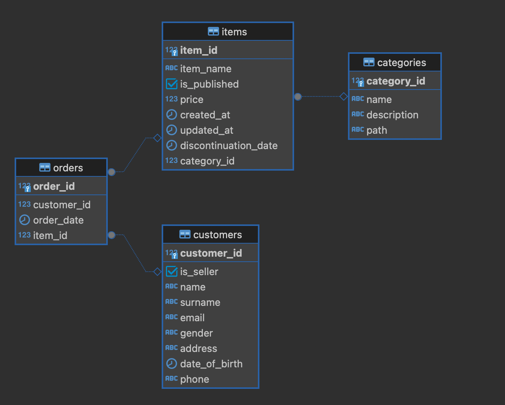

# Challenge de Mercado Libre
Este repositorio contiene los archivos requeridos por el challenge de Mercado Libre. Las consignas pueden encontrarse en el archivo utils/consignas.pdf.


## Primera parte
Todos los archivos correspondientes a la primera parte del challenge se encuentran en la carpeta *parte_1*.

### Diagrama de entidad-relación
El Diagrama de entidad-relación consta de cuatro entidades relacionadas entre sí. 



#### Entidades
##### Customers
Almacena datos de todos los usuarios, ya sean compradores o vendedores. Su clave primaria es el campo customer_id. 

| **Campo**        | **Tipo de dato** | **Descripción**                                               |
|------------------|------------------|---------------------------------------------------------------|
| customer_id (PK) | int              | ID del usuario.                                               |
| is_seller        | boolean          | True si el usuario es un vendedor y false si es un comprador. |
| name             | varchar          | Nombre(s) del usuario.                                        |
| surname          | varchar          | Apellido(s) del usuario.                                      |
| email            | varchar          | Correo electrónico del usuario.                               |
| gender           | varchar          | Género del usuario.                                           |
| address          | varchar          | Domicilio del usuario.                                        |
| date_of_birth    | date             | Fecha de nacimiento del usuario.                              |
| phone            | varchar          | Número de teléfono del usuario.                               |

##### Orders
Almacena datos de todas las órdenes realizadas, considerando que cada ítem pertenece a una orden distinta (no contempla carritos de compra). No se incluyó un campo de cantidad de ítems por esta misma razón.

| **Campo**     | **Tipo de dato** | **Descripción**                   |
|---------------|------------------|-----------------------------------|
| order_id (PK) | int              | ID de la orden.                   |
| customer_id   | in               | ID del usuario.                   |
| order_date    | date             | Fecha en que se realizó la orden. |
| item_id       | int              | ID del ítem que se compró.        |

##### Items
Almacena datos de todos los productos publicados en el marketplace, incluyendo aquellos que no están disponibles en la actualidad.

| **Campo**            | **Tipo de dato** | **Descripción**                                                                                 |
|----------------------|------------------|-------------------------------------------------------------------------------------------------|
| item_id (PK)         | int              | ID del producto.                                                                                |
| is_published         | boolean          | True si el producto se encuentra publicado actualmente y false si ya no se encuentra publicado. |
| price                | float            | Precio del producto en dólares.                                                                 |
| created_at           | date             | Fecha de creación del registro.                                                                 |
| updated_at           | date             | Fecha de actualización del registro.                                                            |
| discontinuation_date | date             | Fecha de baja del producto, si es que aplica. Si no aplica este campo será nulo.                |
| category_id          | int              | ID de la categoría del producto.                                                                |

##### Categories
Almacena datos de todas las categorías del marketplace.

| **Campo**        | **Tipo de dato** | **Descripción**              |
|------------------|------------------|------------------------------|
| category_id (PK) | int              | ID de la categoría.          |
| name             | varchar          | Nombre de la categoría.      |
| description      | varchar          | Descripción de la categoría. |
| path             | varchar          | Path de la categoría.        |


#### Relaciones
Como el enunciado menciona que no se utilizan carritos de compra, sino que cada ítem se considera como una orden separada se estableció una relación 1:n entre la tabla “items” y la tabla “orders”. Esto implica que una compra puede tener un solo ítem, pero un ítem puede estar incluído en más de una compra.
Por otro lado, la relación entre las tablas “categories” e “items” es 1:n ya que una categoría puede contener varios productos, pero un producto solo pertenecerá a una categoría.
Finalmente, la relación entre las tablas “customers” y “orders” es 1:n ya que un vendedor puede ejecutar más de una orden, pero una orden debe ser ejecutada por un solo vendedor.

NOTA: en este caso fue posible establecer una relación entre la tabla “customers” y la tabla “orders” ya que las queries analíticas sólo requieren información sobre los vendedores. Sin embargo, sería recomendable separar la tabla “customers” en dos tablas: una para vendedores y otra para compradores. A su vez, eliminar el campo “customer_id” de la tabla orders y reemplazarlo por dos nuevos campos “buyer_id” y “seller_id”.
Como probablemente en el futuro se va a requerir hacer analítica sobre los compradores, sería una buena práctica hacer el diseño así desde el principio para evitar reprocesar datos.


**Clustering y partitioning**
Dado que las queries de análisis utilizan filtros de fecha, podría ser aconsejable el uso de particiones de acuerdo a las columnas de fechas de cada tabla. Esto, dependiendo del volumen de datos y por lo tanto de la cantidad de particiones generadas, podría mejorar la performance de las queries.

También se podría considerar realizar clustering en algunas de las tablas para mejorar la performance de las queries. Una buena práctica podría ser utilizar como campos de clustering aquellos que participan en los joins entre las tablas.


## Segunda parte

Todos los archivos correspondientes a la segunda parte del challenge se encuentran en la carpeta *parte_2*.

### Requisitos
Luego de clonar el repositorio, deben instalarse las librerías de Python necesarias utilizando la siguiente línea de código:
```
pip install -r utils/requirements.txt
```
Al correr los scripts se creará un archivo llamado *run_history.log* que almacena los logs desde la primera corrida. 

### Archivo parametros.yml
Desde este archivo se podrán gestionar distintos parámetros tales como la cantidad de ítems a obtener en el llamado de la API, la categorías que se quieren analizar y los campos que deseamos que contenga el csv generado. Luego, los scripts de la carga de datos llamarán a los parámetros de *parametros.yaml* sin necesidad de hardcodear dichas variables. Esto permite modificar rápidamente los valores de los parámetros en caso de ser necesario.

### Archivos de ingesta
La creación del csv está separada en dos scripts de ingesta: el archivo *utilidades.py* almacena métodos y atributos que serán útiles a la hora de realizar la ingesta mientras que en el archivo *cargar_datos.py* se realiza la ingesta propiamente dicha. Este último se encargará de realizar los llamados a la API y generar un archivo llamado *data.csv* dentro de la carpeta *parte_2*.